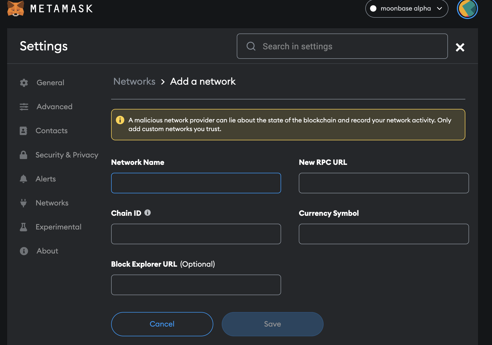
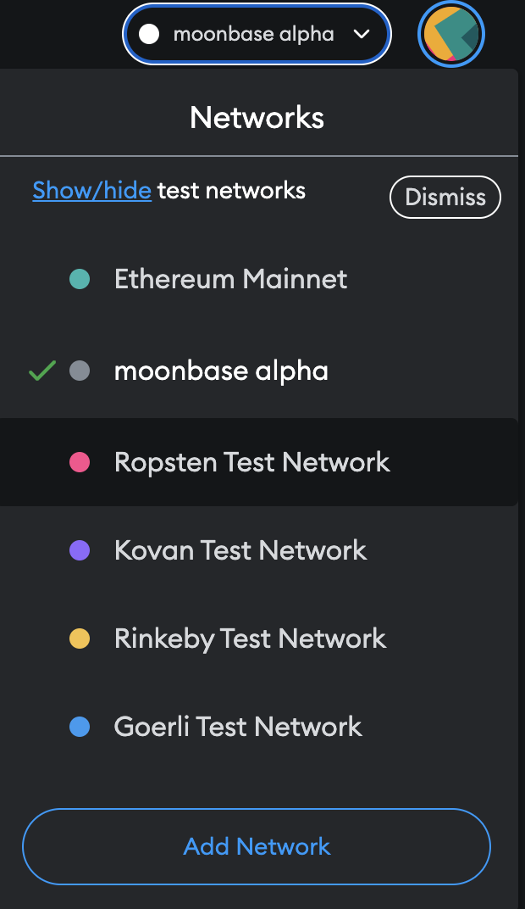
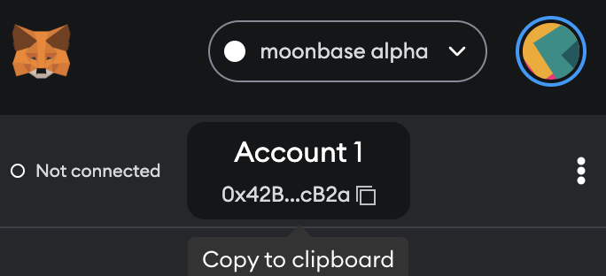
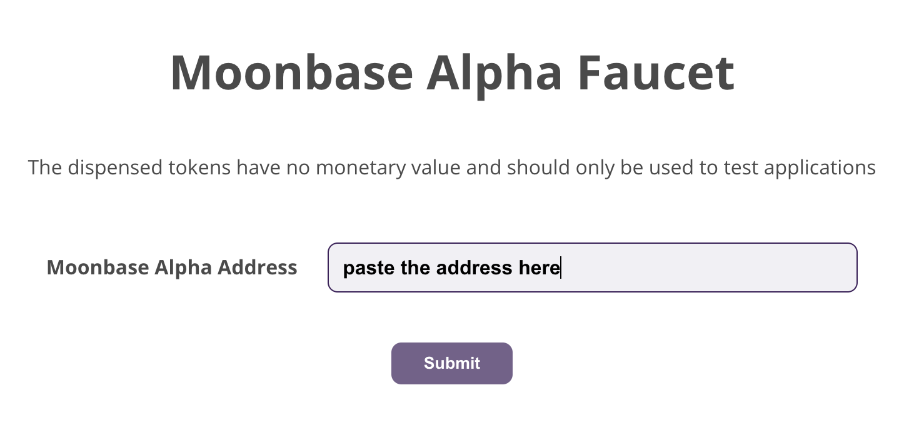
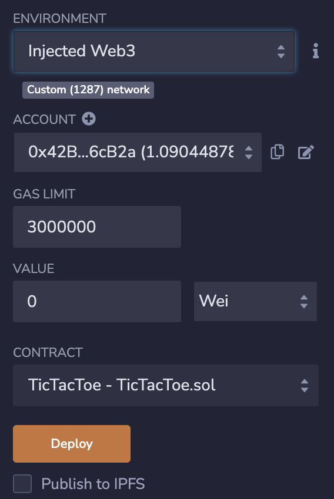
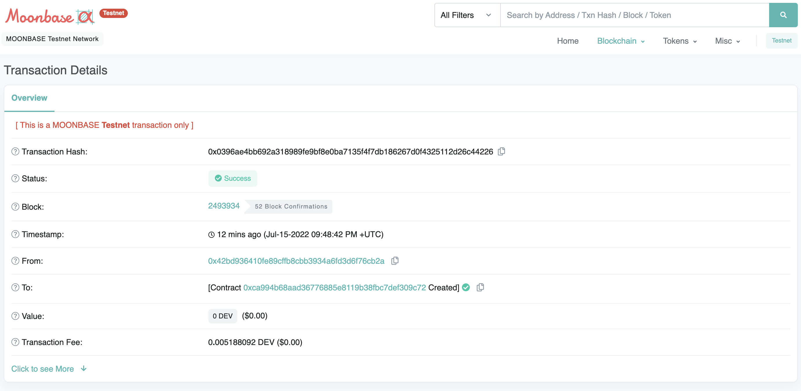

# Tutorial on Solidity smart-contract deployment on Moonbase Alpha test-network
This is a example project to demonstrate deployment of Solidity smart-contract into Polkadot Moonbeam parachain's Moonbase Alpha test network. 

## Prerequisites
1. Metamask account

## Step 1 - add test network in Metamask
To deploy smart-contracts and interact with our test-network we have to connect it to Metamask account.

To add a new network go to *Settings > Networks > Add a network*. You will see a form that asks you should see following form:



Fill in the following information to corresponding fields and add network:

Network Name: {NETWORK_NAME}

New RPC URL: https://rpc.testnet.moonbeam.network

Chain ID: 1287

Currency Symbol: DEV

If there are not problems, you should be able to see the added test network in Metamask networks:



## Step 2 - get some DEV token
DEV token is a utility token used in Moonbase Alpha test-network. When we deploy or interact with smart-contract DEV token will be used. So you should get some DEV token from a Moonbase Alpha faucet. This faucet can be useful: 
https://apps.moonbeam.network/moonbase-alpha/faucet/

Visit the link above, copy your account address and request DEV token:





## Step 3 - deploy the smart-contract

Now we go to https://remix.ethereum.org/ and create TicTacToe.sol file. You can import the TicTacToe.sol file from the ```smart-contract``` folder of this repository, or just copy the content of the file and paste in the remix editor. Once you got the code in the remix editor, compile it and switch to deployment section.
There choose ```Injected Web3``` from ENVIRONMENTS dropdown menu. That choice automatically picks the account in Moonbase Aplha network, if that account is chosen in Metamask.



If everything went well up to this point, you can click Deploy button and get the smart-contract it deployed.

## Step 4 - verify the deployment transaction
Similar to Ethereum, Moonbeam has its own moonscan.io website where we can track status of transactions. For Moonbase Alpha network follow this link: https://moonbase.moonscan.io/
Search for deployed smart-contract by deployment transaction hash. You will probably see similar thing to this:



Congratulations, you could successfully deploy a Solidity smart-contract in test network of Moonbeam parachain.

If you followed along till this place, thank you for your attention!
